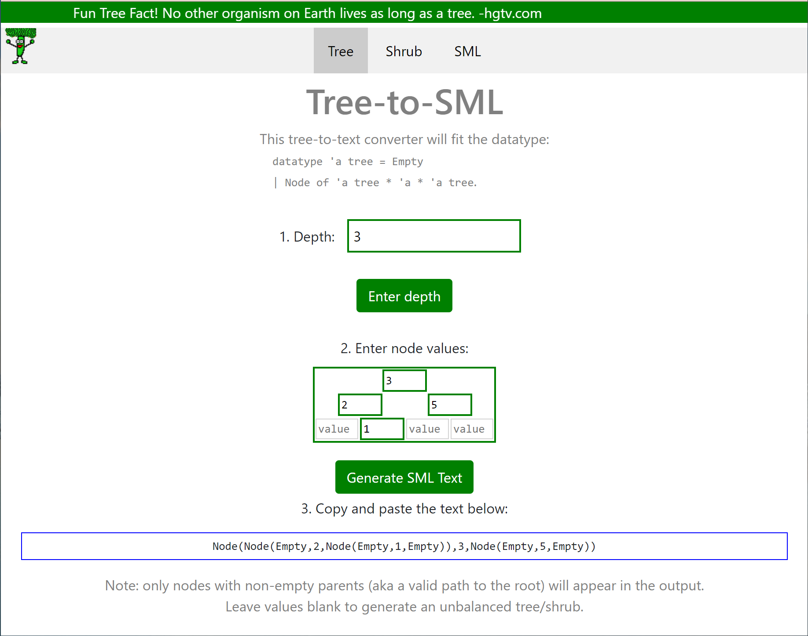

# tree-to-sml-converter
Test cases involving trees are difficult to type out in SML due to the many syntactic requirements (Node's, Empty's, parentheses, and commas).

This page is meant to help both develop and visualize tree test cases to encourage testing of SML tree functions.

## Features
- Tree-to-SML conversion
- SML-to-Tree conversion
- Shrub-to-SML conversion

The datatypes for the output are defined as follows:
```
datatype 'a tree = Empty | Node of 'a tree * 'a * 'a tree.
datatype 'a shrub = Empty | Leaf of 'a | Node of 'a shrub * 'a shrub.
```
The trees/shrubs are represented as a table.

The SML-to-Tree conversion does not handle SML texts with parentheses and commas within quotations.
For Tree/Shrub-to-SML conversion, valid nodes (aka non-empty nodes that have a valid path to the root) are given a green border when the SML text is generated.
<br />
>

Built with HTML, CSS, JavaScript.

GitHub Pages Link: https://leesue630.github.io/tree-to-sml-converter/
